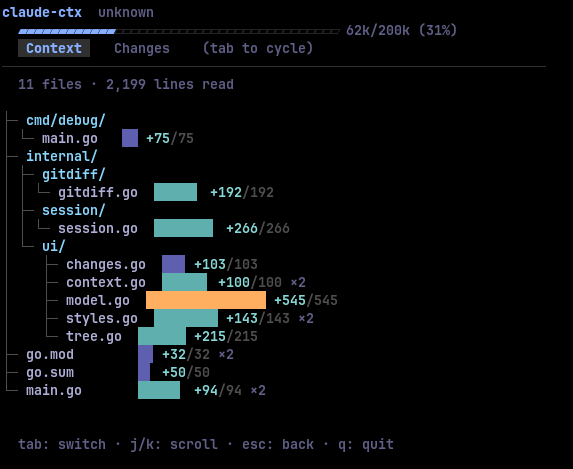
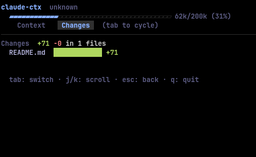

# claude-ctx

TUI-дашборд для визуализации сессий [Claude Code](https://docs.anthropic.com/en/docs/claude-code). Показывает контекст, прочитанные файлы, токены и git-изменения в реальном времени.

## Скриншоты

| Context | Changes |
|---------|---------|
|  |  |

## Возможности

- **Session picker** — выбор из последних сессий с информацией о проекте, модели и времени
- **Context tab** — дерево файлов, прочитанных за сессию, с количеством строк и индикаторами повторных чтений
- **Changes tab** — git diff (staged, unstaged, untracked) с визуализацией добавленных/удалённых строк
- **Context bar** — шкала потребления токенов с цветовой индикацией (синий → жёлтый → красный)
- **Live-обновления** — автоматическое отслеживание активных сессий через fsnotify
- **Subagent-поддержка** — агрегация чтений из дочерних агентов

## Установка

```bash
go install github.com/ekz/claude-ctx@latest
```

Или из исходников:

```bash
git clone https://github.com/ekz/claude-ctx.git
cd claude-ctx
go build -o claude-ctx
```

## Использование

```bash
# Интерактивный выбор сессии
claude-ctx

# Открыть последнюю сессию
claude-ctx -latest

# Открыть конкретную сессию по UUID
claude-ctx -session <uuid>
```

## Управление

### Выбор сессии

| Клавиша | Действие |
|---------|----------|
| `↑` `↓` / `j` `k` | Навигация |
| `Enter` | Выбрать сессию |
| `q` / `Esc` | Выход |

### Просмотр сессии

| Клавиша | Действие |
|---------|----------|
| `Tab` / `h` `l` | Переключение вкладок |
| `↑` `↓` / `j` `k` | Скролл |
| `Esc` | Назад к списку |
| `q` / `Ctrl+C` | Выход |

## Стек

- [Go](https://go.dev)
- [Bubble Tea](https://github.com/charmbracelet/bubbletea) — TUI-фреймворк
- [Lip Gloss](https://github.com/charmbracelet/lipgloss) — стилизация
- [fsnotify](https://github.com/fsnotify/fsnotify) — отслеживание файлов

Цветовая схема — Tokyo Night.

## Как работает

Читает JSONL-логи сессий из `~/.claude/projects/`, парсит вызовы инструментов (Read, Grep, Glob и др.), собирает статистику по файлам и токенам, отображает в интерактивном терминальном интерфейсе.
